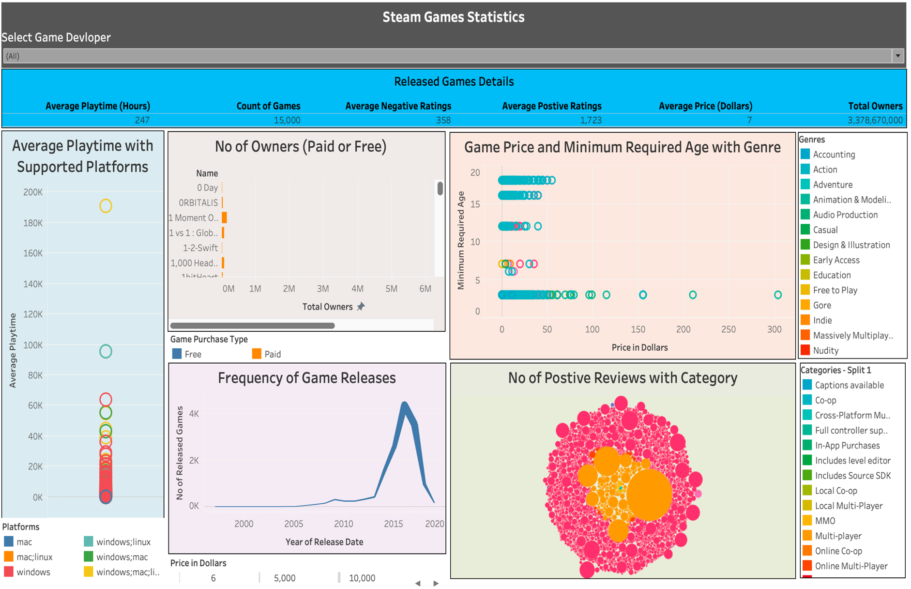

# SteamGamesDashboardTableau #

This project consists of an interactive dashboard that allows users to compare and analyze various statistical facts of games released on the popular digital video game distribution service "Steam". The dashboard provides users with the option to select one or more developers from a dropdown list, which then displays information about the games released by the selected developer(s).

## Pre-processing of Data and Tools Used ##

The dataset was pre-processed to clean the data for optimal visualization. Various techniques such as data cleansing, segmentation, and metadata and statistical analysis were used to clean and shape the data. The dataset was reduced to 15000 records to improve dashboard performance. Excel was used for data cleansing and completion, and Tableau was used for segmentation and metadata and statistical analysis.

## Dataset ##

The altered dataset had around 15000 records with 14 columns containing information about game name, release date, developer, platforms, required age, categories, genre, positive and negative ratings, average playtime, owners, price, and game purchase type.

## Encoding Channels and Idioms ##

The following encoding channels and idioms were used to design the interactive dashboard:

 - Multi-select dropdown to choose Developer(s)
 - Text Table to display related game details
 - Scatter Plots to visualize game price and minimum required age with genre
 - Lines to show Frequency of Game Releases 
 - Packed Bubbles conveys No of positive reviews
 - Horizontal Bars represents No of Owners (Paid or Free)
 - Circle Views depicts Average playtime with supported Platforms 
The dashboard provides users with an easy-to-use and simple representation of the numerical data, which provides insights about the overall summary.

## How to Use ##

1. Download or clone the Repository Files into your computer.
2. Install Tableau Desktop on your computer.
3. Open the provided "Steam Game Statistics Dashboard.twbx" file from the cloned or downloaded Git Repository. It should automatically open in Tableau.
The dashboard should appear directly on the screen. (The .twbx already includes the cleaned dataset from which the values are shown in Dashboard).
4. Click on the Presentation mode Icon as shown in the below screenshot to view the dashboard in full screen.

You can interact with the dashboard by selecting different filters and options to explore the data in more detail.
